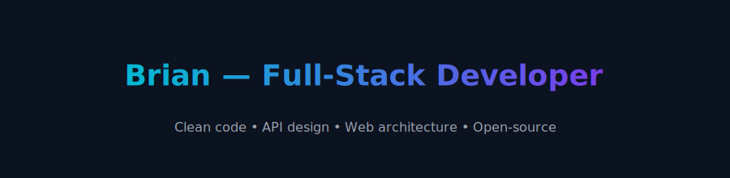

  

   
  
  
  ·

---

## 💻 About Me

I'm a full-stack developer who's genuinely passionate about building clean, elegant solutions to complex technical problems. I thrive on turning ideas into well-executed digital experiences with both creative vision and technical precision.

- 🔭 **Currently working on** fun projects built with modern front-end technologies
- 🌱 **Always learning** new frameworks, tools, and up-to-date industry best practices
- 💡 **Passionate about** web development, software architecture, and the open-source community
- 👨‍💻 **Experience with** full-stack development and API design
- 🎯 **Goal** to make real open-source contributions and build products that are useful and pleasant to use
- 💬 **Ask me about** JavaScript, TypeScript, React, Next.js, Node.js, and anything web-dev related
- ⚡ **Fun fact** I'm pretty good at turning cup after cup of hot coffee into working lines of code ☕

---

## 🖥️ Tech Stack

  
  
  
  
  
  
  
  
  
  
  
  
  
  

---

  
  **Made with passion & lots of ☕**
  
  
  

